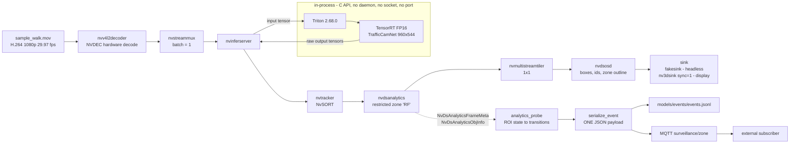

# Video Surveillance with DeepStream

**Real-time person detection, tracking and restricted-zone monitoring on an
NVIDIA Jetson Orin Nano Super**, built from GStreamer, TensorRT and DeepStream,
runnable host-native or in a container, and served through in-process Triton.

A recorded video is replayed as a simulated camera — paced in real time, not
consumed as fast as the hardware allows — and every frame is run through a
TensorRT-optimised person detector. Each detected person is then given a
persistent identity that survives from frame to frame, and checked against a
restricted zone: is *this* person inside the area that matters? Results are drawn
on screen, exposed as structured metadata so they can be checked by a machine
rather than by eye, and published as zone-entry and zone-exit events over MQTT.

Everything runs on the device. Nothing is downloaded at run time, no model is
trained, and no cloud service is involved.

---

## Pipeline

The deployed path. Inference is served through `nvinferserver` and an
**in-process Triton** that executes the TensorRT FP16 engine — one process, no
daemon, no socket. Monitoring is an **off-path metadata branch**, not a stage in
the video pipeline.



Frames stay in NVMM (NVIDIA hardware memory) from decode to display, so there is
no copy into system memory anywhere in the video path. Triton returns **raw
tensors** — bounding-box clustering and decoding happen in DeepStream, after the
return edge.

Without `--triton`, the same scripts run the Milestone 6 path, where a single
`nvinfer` element replaces `nvinferserver` + Triton and everything else is
unchanged.

## What it does

- **Simulates a camera** from a recorded clip, paced by the pipeline clock so it
  behaves like a live 30 fps source rather than a file being read at full speed.
- **Detects people** with TrafficCamNet, running as a TensorRT engine on the GPU.
- **Tracks each person across frames** with NvSORT, so a detection becomes an
  identity — the prerequisite for saying "*this* person entered the zone".
- **Watches a restricted zone** and reports, per frame, whether a tracked person
  is inside it. The zone is configuration, not something the model learned.
- **Draws bounding boxes, labels, track IDs and the zone outline** on screen.
- **Emits per-frame metadata at three points** — detector, tracker and analytics
  — so correctness is asserted from data, never from "it looked right".
- **Runs in a container** with the same behaviour — detector and tracker metadata
  are byte-identical to the host-native run, on all 288 frames — and serves
  inference through **in-process Triton** around that same FP16 engine.
- **Reports zone entry and exit as structured events**, written as JSON Lines and
  published over **MQTT** to a subscriber outside the container. Transitions
  only, never one event per frame.
- **Verifies itself headlessly**: eight verification suites run the pipeline with
  no display, assert the result from per-frame metadata, and exit non-zero on
  failure.

## Results

Detection and tracking on the default clip, at the model's stock reference
thresholds and NVIDIA's stock NvSORT configuration:

| | |
|---|---|
| Frames processed | **288 of 288** |
| `person` detections | **230**, across 230 frames (79.9%) |
| False positives | **zero** `car`, `bicycle` or `road_sign` in 288 frames |
| Confidence on the subject | 0.67 – 0.82 |
| Frames with a tracked person | **230 of 230** — every detection got an identity |
| Longest continuous track | **224 frames** (50 → 273), one unbroken ID |
| Mid-track ID switches | **zero** |
| Unique track IDs | 2 — one ID change, in the first 6 frames as the person enters |

The tracker is not credited with what this clip cannot test. There are **no
interior detector gaps**, so gap bridging, shadow tracking and occlusion recovery
were never invoked and are recorded as
[NOT EXERCISED](docs/milestone-05-tracking.md) rather than as passing.

Restricted-zone occupancy, from DeepStream's own analytics metadata:

| | |
|---|---|
| Zone | rectangle x ∈ [650, 1260], y ∈ [640, 820] at 1920×1080 |
| Enters | **frame 109** |
| Inside | **75 consecutive frames — 2.50 s**, one unbroken interval |
| Exits | after **frame 183**, then tracked for 90 more frames |
| Agreement with an independent recomputation | **100.00%** over 230 frames |
| With `class-id=0` instead of `2` | **zero** occupancy — the class filter, not the geometry, selects the person |

The zone's geometry was **derived from the measured track**, not chosen, and
placed so that the foot-point rule DeepStream actually uses gives 75 frames while
a centroid rule would give 0 — turning "which point does it test?" into an
experiment. [Full detail →](docs/milestone-05-restricted-zone.md)

Inference cost, measured per precision at batch 1, 960×544 (3 interleaved
repetitions each):

| Engine | GPU compute | End-to-end | Throughput | Size | Frame budget used |
|---|---|---|---|---|---|
| FP32 | 12.70 ms | 12.95 ms | 78.7 qps | 9.01 MiB | 38.8% |
| **FP16** *(default)* | **3.22 ms** | **3.53 ms** | **310.1 qps** | **3.05 MiB** | **10.6%** |
| INT8 | 1.93 ms | 2.29 ms | 517.4 qps | 2.59 MiB | 6.9% |

All three are comfortably real-time for one 29.97 fps camera (a 33.37 ms budget
per frame), so precision is a headroom decision rather than a feasibility one.
FP16 is the default; INT8 is built and benchmarked but held in reserve.

> These are **performance** figures. They say nothing about whether reduced
> precision preserves detection accuracy — that is a separate experiment, and the
> evidence it would require is
> [defined but not yet gathered](docs/milestone-04-tensorrt-optimization.md).

The **assembled** pipeline — decode, Triton inference, tracking, analytics, tiler
and OSD together — measured over a 604 s soak of roughly 109,000 frames:

| | |
|---|---|
| Sustained throughput | **178.14 fps** steady-window mean (n=540, sd 1.36) |
| Independent cross-check | 178.03 fps — 0.06% from DeepStream's own figure |
| Processing headroom | **~5.94×** the 29.97 fps source rate |
| Degradation over ten minutes | none — fitted trend +0.010 fps/min |
| Peak junction temperature | 64.97 °C, with every CPU/GPU frequency-capping cooling device at state 0 |

> **178 fps is unpaced processing *capacity*, not 178 fps of real-time
> playback.** The soak runs `sync=0` on purpose, to find the ceiling and the
> harshest thermal condition in one run. The display path uses `sync=1` and runs
> at the source's 29.97 fps.
> [Full detail →](docs/milestone-08-edge-deployment.md)

Restricted-zone events, from the same analytics metadata:

```json
{"event":"zone_enter","event_time_utc":"...","frame_number":109,"stream_time_seconds":3.637,
 "zone":"RF","track_id":1,"class":"person","occupancy":1}
{"event":"zone_exit","event_time_utc":"...","frame_number":183,"stream_time_seconds":6.106,
 "zone":"RF","track_id":1,"class":"person","occupancy":0,"frames_inside":75,
 "duration_seconds":2.502,"exit_reason":"left_zone"}
```

**Two events for 288 frames**, 409 bytes in total — the whole restricted-zone
result, expressed as transitions rather than as one line per frame. Each event is
serialised once and the same bytes go to the JSON Lines file and to MQTT: a
subscriber started before the pipeline received both messages, byte-identical to
the file, each acknowledged by the broker at QoS 1 (at-least-once, not
exactly-once). [Full detail →](docs/milestone-09-mqtt.md)

## Requirements

**Always needed**

- **An NVIDIA Jetson** with L4T and DeepStream. Developed on a **Jetson Orin Nano
  Super**: JetPack 7.2, L4T R39.2, Ubuntu 24.04, DeepStream 9.1.0,
  TensorRT 10.16.2, CUDA 13.2.
- **GStreamer 1.x** with `gst-launch-1.0`, `gst-inspect-1.0`, `gst-discoverer-1.0`.
- **NVIDIA GStreamer elements**: `nvv4l2decoder`, `nvstreammux`, `nvinfer`,
  `nvtracker`, `nvdsanalytics`, `nvmultistreamtiler`, `nvdsosd`, `nv3dsink`.
- **A C++ toolchain** (`g++`, `make`, `pkg-config`) — only to build the
  verification probe, which is not part of the application.

**For the containerised and Triton paths**

- **Docker**, with the **NVIDIA container runtime** registered. No
  `--privileged`, `--device` or `--gpus` is used; the runtime injects GPU, NVDEC,
  VIC and display through its CSV mode.
- The `nvinferserver` element and **Triton** come from the container image, not
  from the host — the host's `libnvdsgst_inferserver.so` has an unmet
  `libtritonserver.so` dependency, and resolving it there needs `sudo`.

**For the MQTT mode only**

- An **MQTT broker** reachable at the configured host and port. In this
  environment that is **Mosquitto on `127.0.0.1:1883`**, listening on loopback
  only — which is why `--events-mqtt` is the one mode that uses `--network host`.
  Override with `MQTT_HOST`, `MQTT_PORT` and `MQTT_TOPIC`.
- **Nothing else needs a broker.** Detection, tracking, the restricted zone and
  the JSON Lines event file all work with no network at all.

**For visible playback only**

- A display. Everything else runs headlessly.

Nothing needs to be installed or downloaded to run the pipeline. The model, the
calibration data, the tracker library, the tracker configuration and the sample
video all ship with DeepStream and are read from their install path.
The DeepStream version is discovered at run time through the
`/opt/nvidia/deepstream/deepstream` symlink, so no version is hard-coded anywhere.

## Run the finished system

The finished system is the **Triton path in a container**. It needs one image,
`video-surveillance-deepstream:m7-triton`, and one script. Every invocation is
`docker run --rm`: nothing persists between runs.

```bash
# Visible, paced at the source's 29.97 fps, on the physically attached monitor.
# Expect a box following the walker, a stable `person <id>` label, the zone
# outlined, and the RF counter stepping 0 -> 1 -> 0.
DISPLAY=:1 ./scripts/run_container.sh --display --triton

# Headless: the same pipeline to a fakesink, writing per-frame metadata to
# models/{detections,tracks}. This is the mode to run over SSH.
./scripts/run_container.sh --headless --triton

# Restricted-zone transitions as JSON Lines in models/events/events.jsonl.
# --network none: writing a file needs no broker and no network.
./scripts/run_container.sh --events --triton

# The same events, additionally published to MQTT. Needs a reachable broker;
# uses --network host because Mosquitto here listens on loopback only.
./scripts/run_container.sh --events-mqtt --triton
```

To watch the MQTT mode deliver, start a subscriber **before** the run:

```bash
mosquitto_sub -h 127.0.0.1 -t surveillance/zone -v
```

To check any of it rather than take its word:

```bash
./scripts/verify_triton.sh    # the Triton serving path
./scripts/verify_zone.sh      # the restricted zone, host-native
./scripts/verify_events.sh    # the event stream
./scripts/verify_mqtt.sh      # delivery to an external subscriber
```

**Network scope, precisely** — three cases, not two:

| Mode | Network |
|---|---|
| `--headless`, `--zone`, `--events`, `--shell` | explicit `--network none` |
| `--display` | Docker's **default bridge** — needs no network, but no `--network` flag is passed, so it is not isolated either |
| `--events-mqtt` | `--network host`, required to reach the loopback broker |

### Seeing it without running it

`demo/demo.mp4` is a 20-second screen capture of the two commands above: the
paced visible run showing the box, the `person 1` track label, the zone outline
and the `RF` counter stepping 0 → 1 → 0; then, **as a clearly captioned separate
run**, a subscriber receiving the two restricted-zone events over MQTT.

The file is **git-ignored and delivered alongside the repository**, not committed.
[`demo/README.md`](demo/README.md) records the exact capture pipeline, both
commands, and the caveats — including that the capture uses a CPU encoder and is
**not** a performance measurement.

## Quick start — from a bare machine

```bash
# 1. Check the environment
./scripts/common.sh --selftest        # GStreamer, DeepStream, elements, display
./scripts/trt_common.sh --selftest    # TensorRT toolchain and model assets

# 2. Build the TensorRT engines (~4.5 min; one-off)
./scripts/build_engines.sh --precision all

# 3. Run detection and tracking host-native, and verify both headlessly
./scripts/ds_common.sh --selftest
./scripts/verify_inference.sh       # detection
./scripts/verify_tracking.sh        # identity across frames
./scripts/verify_zone.sh            # restricted-zone occupancy

# 4. Watch it, if a display is attached
./scripts/run_inference.sh

# 5. Then run the deployed system — see "Run the finished system" above
./scripts/run_container.sh --headless --triton
```

Step 2 is the only build the finished system needs. **The container images are
not rebuilt as part of normal use**: the deployed artifact is the existing
`m7-triton` image, and everything machine-specific — the engine, the Triton model
repository, the MQTT probe — reaches it by bind mount rather than by baking it in.

<details>
<summary>Building the images, and why you probably should not</summary>

`run_container.sh --build [--triton]` still works and is still the record of how
each image was produced. Two things are worth knowing before running it:

- **It is a multi-gigabyte operation.** The Triton image is 16.03 GB derived from
  a 10.4 GB base; a rebuild once drove free space on this 116 GB filesystem down
  to 14.48 GB. Milestone 8 therefore adopted a standing rule for the rest of the
  project: **never build, pull or prune** — bind-mount instead
  ([detail](docs/milestone-08-inspection.md)).
- **`docker system prune -a` would delete the deployment artifact.** Docker
  reports the image's own layers as "reclaimable" purely because no container
  references them.

**The Milestone 6 image no longer exists on this machine**; it and its base were
deleted to make room for the Triton stack. So `verify_container.sh` is a **frozen
earlier passing result**, not something runnable today — recreating it would mean
a full rebuild. `verify_triton.sh` compares against a hash-sealed capture of that
M6 run instead, which is what makes the comparison survive the image's deletion
([detail](docs/milestone-07-triton.md)).

</details>

If `DISPLAY` is unset in your shell but a desktop session is running on the
console, point at it explicitly:

```bash
DISPLAY=:1 ./scripts/run_inference.sh
```

The window opens on the physically attached monitor, not in an SSH client.

## Usage

**Inference, tracking and the restricted zone**

| Command | What it does |
|---|---|
| `./scripts/run_inference.sh` | Visible run with boxes, IDs and the zone outline, paced in real time |
| `./scripts/verify_inference.sh` | Headless detection run with eight machine-checked assertions |
| `./scripts/verify_tracking.sh` | Headless tracking run: four pipelines, nine checks, and a full identity report |
| `./scripts/verify_zone.sh` | Headless zone run: five pipelines, fourteen checks, and an occupancy report |

**Container**

| Command | What it does |
|---|---|
| `./scripts/run_container.sh --build` | Builds the image; fails the build if the TensorRT pin did not take. Multi-gigabyte — see the note under Quick start |
| `./scripts/run_container.sh --headless` | Runs the pipeline in a container, writing its metadata to the host |
| `./scripts/run_container.sh --zone` | Runs the analytics probe, writing the restricted-zone verdict |
| `./scripts/run_container.sh --display` | Visible playback from the container on the physical monitor |
| `./scripts/run_container.sh --shell` | Interactive shell with the same mounts |
| `./scripts/verify_container.sh` | Twelve checks, diffing container output against a fresh host-native baseline. **Needs the Milestone 6 image, which no longer exists here** — a frozen earlier result rather than a runnable one |

**Triton serving** — add `--triton` to any container mode to serve inference
through `nvinferserver` and an in-process Triton instead of `nvinfer`. Without
it, every mode is the Milestone 6 `nvinfer` path.

| Command | What it does |
|---|---|
| `./scripts/run_container.sh --build --triton` | Builds the Triton image; asserts all 18 TensorRT packages are pinned and Triton is intact |
| `./scripts/run_container.sh --headless --triton` | Runs the pipeline through in-process Triton, writing its metadata to the host |
| `./scripts/run_container.sh --display --triton` | Visible Triton playback on the physical monitor |
| `./scripts/run_container.sh --events --triton` | Writes JSON Lines restricted-zone events. `--network none` — no broker needed |
| `./scripts/run_container.sh --events-mqtt --triton` | The same, and publishes each event to MQTT. `--network host` — the broker listens on loopback only |
| `./scripts/verify_triton.sh` | Eleven checks, comparing the Triton run against a frozen, hash-verified Milestone 6 baseline |
| `./scripts/verify_events.sh` | Twenty checks on the event stream, cross-checked against an independent recomputation |
| `./scripts/verify_mqtt.sh` | Twenty checks on MQTT delivery, including a byte comparison with the JSONL and a broker-unreachable negative test |

**Model and engines**

| Command | What it does |
|---|---|
| `./scripts/inspect_model.sh` | Reports the model's input/output contract and INT8 calibration coverage. Builds nothing |
| `./scripts/build_engines.sh --precision fp16` | Builds one engine (`fp32`, `fp16`, `int8` or `all`) and verifies the artifact |
| `./scripts/engine_report.sh` | Reports what an engine **actually** is — the per-layer precisions TensorRT selected, not the ones requested |
| `./scripts/benchmark_engines.sh` | Interleaved, repeated precision comparison with spread reporting |

**Edge characterisation**

| Command | What it does |
|---|---|
| `./scripts/measure_edge.sh` | Idle baseline, then a bounded unpaced soak of the deployed pipeline, with `tegrastats`, `**PERF`, RSS and cooling-device state sampled throughout. Telemetry lands in `models/edge/`, git-ignored |

**Video source**

| Command | What it does |
|---|---|
| `./scripts/inspect_video.sh [--caps]` | Container, codec, resolution, frame rate, duration; `--caps` dumps negotiated caps per link |
| `./scripts/run_simulated_stream.sh [--loop]` | Visible playback of the source alone, no inference |
| `./scripts/verify_simulated_stream.sh` | Headless check of frame flow and real-time pacing |

Two sources are available: `sample_walk.mov` (default — one person walking,
9.61 s) and `sample_1080p_h264.mp4` (`--crowded` — many pedestrians, a cyclist and
traffic, 48.10 s). Both are H.264 in an ISO-BMFF container, so the same pipeline
serves both unchanged.

## How it works

**Simulated camera.** Nothing about a file is inherently real-time. The pacing
comes from clock synchronisation at the sink: each decoded frame is held until its
presentation timestamp arrives, which back-pressures the decoder and the file
reader until the whole pipeline settles at the clip's natural frame rate. Proven
by measurement — 9.80 s paced against a 9.61 s clip, versus 1.53 s unpaced.
[Full detail →](docs/milestone-02-video-input.md)

**Detection model.** TrafficCamNet is a DetectNet_v2 detector on a pruned ResNet18
backbone. It is fully convolutional with no anchor boxes and no NMS inside the
network: for each cell of a 60×34 grid it predicts a per-class confidence and four
box-edge offsets. Clustering those overlapping predictions into single detections
happens outside the model, in DeepStream, and is configurable.
[Full detail →](docs/milestone-03-model-selection.md)

**Precision.** The ONNX model is compiled into TensorRT engines at FP32, FP16 and
INT8. INT8 uses the calibration cache NVIDIA ships, so no calibration dataset is
needed. Engines are treated as build artifacts, never committed — one is valid
only for the TensorRT version, GPU and batch profile that produced it.
[Full detail →](docs/milestone-04-tensorrt-optimization.md)

**Inference pipeline.** `nvstreammux` batches frames and attaches the metadata
structure; `nvinfer` preprocesses, runs the engine and attaches one
`NvDsObjectMeta` per detection; `nvdsosd` draws them. The 1×1 tiler looks
redundant with a single source but is required — without a fresh buffer upstream,
the OSD draws in place and previous frames' boxes persist as a visible trail.
[Full detail →](docs/milestone-05-inference-pipeline.md) ·
[the ghosting investigation →](docs/milestone-05-osd-ghosting.md)

**Tracking.** DeepStream 9.1 ships a single tracker library; the backend is
chosen entirely by the YAML handed to it. NvSORT was picked over the simpler IOU
tracker because IOU has no motion model at all, and over NVIDIA's default NvDCF
because NvDCF's appearance matching cannot be tested on a clip with one person
who is never occluded. NVIDIA's configuration is used exactly as installed.
Identity is asserted from the tracker's own metadata dump: the criterion is zero
ID switches *mid-track*, not a coverage percentage, because only a break in the
middle of a trajectory would defeat zone logic.
[Full detail →](docs/milestone-05-tracking.md)

**The restricted zone.** `nvdsanalytics` tests one point per object against a
polygon each frame. That point is not the box centre: it is the centroid shifted
down by half the *smoothed* box height — effectively the person's **feet**, which
is the right choice for a zone drawn on the ground. The zone itself is a config
file, because "which area matters" is a property of the installation, not of the
images. `deepstream-app` can run analytics but cannot report it, so a small C++
pad probe reads the verdict back; it is cross-checked against `deepstream-app`'s
own output rather than trusted.
[Full detail →](docs/milestone-05-restricted-zone.md)

## Verification

**Eight verification suites.** None needs a display, all terminate on their own,
and all exit non-zero on any failure. Evidence comes from per-frame metadata
dumps rather than from appearance, so a passing run is a statement about data.

| Suite | Claim under test | Runnable today? |
|---|---|---|
| `verify_simulated_stream.sh` | Frame flow and real-time pacing of the source | Yes |
| `verify_inference.sh` | Detection | Yes |
| `verify_tracking.sh` | Identity across frames | Yes |
| `verify_zone.sh` | Restricted-zone occupancy | Yes |
| `verify_container.sh` | Containerisation changed nothing | **No** — needs the M6 image, which no longer exists here |
| `verify_triton.sh` | Triton serving preserved behaviour | Yes, against a frozen hash-sealed baseline held outside the repository |
| `verify_events.sh` | The event stream is correct, transition-based and bounded | Yes |
| `verify_mqtt.sh` | Those same bytes reach an external subscriber | Yes, with a broker running |

The four detailed below are the core of the argument.

**`./scripts/verify_inference.sh` — detection**

1. The application runs to a clean end of stream.
2. The prebuilt engine was **deserialized, not rebuilt** — checked in the log and
   by an unchanged checksum.
3. Every frame in the clip was decoded and processed.
4. Batch size is 1 end to end, with no engine/config capability mismatch.
5. `nvinfer` reports no configuration or parser errors.
6. `person` detections exist, with raw per-class counts reported.
7. `class_id 2` really is `person` — proven by re-running with the other classes
   filtered out, so anything surviving is class 2 by construction.
8. No analytics metadata exists.

**`./scripts/verify_tracking.sh` — identity.** Four pipeline runs, nine checks:

1. Clean end of stream.
2. `nvtracker` is genuinely instantiated, and no obsolete config keys are used.
3. The engine is still deserialized, not rebuilt.
4. Both the detector and tracker dumps cover all 288 frames.
5. **The tracker did not change detection** — a control run with the tracker
   disabled produces a detector dump differing on 0 of 288 frames.
6. Every tracked object carries a valid `object_id`, never `UNTRACKED_OBJECT_ID`.
7. **Zero mid-track ID switches** while the detector observes the person
   continuously. Unique IDs and dominant-ID coverage are reported as metrics, not
   as the criterion.
8. A missing tracker **library** is fatal, a missing tracker **config** is not —
   DeepStream silently falls back to defaults, so the real run is checked for the
   absence of that warning. Otherwise a typo would substitute a different tracker
   and every other check would still pass.
9. No analytics yet.

**`./scripts/verify_container.sh` — containerisation.** A host-native baseline
run, two container runs, a facts pass and a negative control; twelve checks. The
decisive two: the container's **detector and tracker metadata differ from the
host run on 0 of 288 per-frame files**. Not "equivalent within tolerance" —
byte-identical, against a baseline captured in the same script run.

That is only provable because the container's TensorRT was deliberately upgraded
from the shipped 10.16.1 to the host's 10.16.2, so both sides load the *same*
engine file. Building a second engine with a different TensorRT would have made
any difference unattributable. The reasoning, the evidence gathered before doing
it, and the cost (it makes the image a custom artifact) are in
[`docs/milestone-06-containerization.md`](docs/milestone-06-containerization.md).

It also prints a full identity report: per-track lifespans, the longest
continuous track, when the track was established, and an explicit list of the
capabilities this clip did **not** exercise.

**`./scripts/verify_zone.sh` — the restricted zone.** Five pipeline runs,
fourteen checks:

1. The application runs cleanly with `nvdsanalytics` instantiated.
2. **Analytics changed neither detection nor tracking** — a control run with it
   disabled differs on 0 of 288 frames, in both dumps.
3. **The probe ran the same pipeline** — its detector output is bit-identical to
   `deepstream-app`'s on all 288 frames, and the one known divergence is bounded
   and required to end long before the zone is reached.
4. Analytics metadata is present and machine-readable on every frame.
5–8. The person is outside, **enters at frame 109 ±2**, stays **75 frames in one
   unbroken interval**, **exits after frame 183 ±2**, and stays tracked for 90
   more frames.
9. **100% agreement** with an independent recomputation of DeepStream's rule.
10. `class-id=2` is what restricts the rule — proven by re-running the identical
    ROI with `class-id=0`, which reports zero occupancy.
11. The ROI test point is the **feet, not the centroid** — 75 frames vs 0.
12. A broken analytics config fails the run loudly (exit 255).
13. No line crossing, overcrowding, direction detection or messaging.
14. Checkpoint 2, checkpoint 1 and Milestone 2 regressions all still pass.

## Project structure

```
├── Dockerfile          M6 image: DeepStream + nvinfer  (docs/milestone-06-containerization.md)
├── Dockerfile.triton   M7 image: + Triton, the DEPLOYED artifact  (docs/milestone-07-triton.md)
├── configs/            deepstream-app, nvinfer, nvinferserver and restricted-zone configuration
├── scripts/            Inspection, build, run, measurement and the eight verification suites
├── tools/              C++ analytics probe: reads the ROI verdict and emits events
├── docs/               Design notes, investigations, verification records, final-report.md
├── demo/               README.md is tracked; the capture itself is not (M10.3)
├── models/
│   ├── triton_model_repo/   config.pbtxt is COMMITTED; 1/model.plan is mounted, not stored
│   ├── engines/             generated TensorRT engines                    [git-ignored]
│   ├── detections/ tracks/  per-frame KITTI metadata dumps                [git-ignored]
│   ├── zone/                per-frame restricted-zone evidence            [git-ignored]
│   ├── events/              events.jsonl, truncated on every run          [git-ignored]
│   └── edge/                tegrastats and soak telemetry                 [git-ignored]
└── media/              Video sources are read from DeepStream, never committed
```

Everything marked `[git-ignored]` is **runtime output**, regenerated on every run
and never a versioned artifact. The figures that matter from those directories
are quoted in the documents instead.

## Documentation

| Topic | Document |
|---|---|
| **The finished system, end to end** | [**`docs/final-report.md`**](docs/final-report.md) |
| **The demo capture** — how it was made, and its caveats | [**`demo/README.md`**](demo/README.md) → `demo/demo.mp4` (git-ignored) |
| Use case definition and AI-task choice | [`docs/milestone-01-use-case.md`](docs/milestone-01-use-case.md) |
| Video input and real-time pacing | [`docs/milestone-02-video-input.md`](docs/milestone-02-video-input.md) |
| Model selection and DetectNet_v2 internals | [`docs/milestone-03-model-selection.md`](docs/milestone-03-model-selection.md) |
| TensorRT optimisation and benchmarks | [`docs/milestone-04-tensorrt-optimization.md`](docs/milestone-04-tensorrt-optimization.md) |
| Inference pipeline | [`docs/milestone-05-inference-pipeline.md`](docs/milestone-05-inference-pipeline.md) |
| The OSD ghosting investigation | [`docs/milestone-05-osd-ghosting.md`](docs/milestone-05-osd-ghosting.md) |
| Object tracking | [`docs/milestone-05-tracking.md`](docs/milestone-05-tracking.md) |
| Restricted-zone analytics | [`docs/milestone-05-restricted-zone.md`](docs/milestone-05-restricted-zone.md) |
| Containerisation | [`docs/milestone-06-containerization.md`](docs/milestone-06-containerization.md) |
| Triton serving | [`docs/milestone-07-triton.md`](docs/milestone-07-triton.md) |
| Edge characterisation under sustained load | [`docs/milestone-08-edge-deployment.md`](docs/milestone-08-edge-deployment.md) |
| Redeployment after load | [`docs/milestone-08-redeployment.md`](docs/milestone-08-redeployment.md) |
| Structured surveillance events | [`docs/milestone-09-events.md`](docs/milestone-09-events.md) |
| MQTT event delivery | [`docs/milestone-09-mqtt.md`](docs/milestone-09-mqtt.md) |
| Engineering roadmap and decisions | [`PLAN.md`](PLAN.md) |

Each document records not just what was built but **why**, along with the
verification evidence and an explicit statement of what remains unproven.

## Roadmap

Detection, tracking and restricted-zone monitoring work end to end, host-native,
containerised, and served through in-process Triton. The deployment has been
characterised on the Jetson under sustained load and redeployed afterwards, and
it emits structured restricted-zone events to a JSON Lines file and publishes the
same payloads over MQTT to an external subscriber.

**All ten milestones are complete.** The two final deliverables are
[`docs/final-report.md`](docs/final-report.md) — the whole system in one
document — and the demo capture, `demo/demo.mp4`.

**The demo video is deliberately not committed.** It is a submission artifact, so
`.gitignore` keeps `demo/*.mp4` out of the repository and the file is delivered
alongside it. What you get from git is the source, the configuration and
[`demo/README.md`](demo/README.md), which records the exact commands that
produced the capture so it can be reproduced rather than taken on trust.

Open questions and technical debt: [`PLAN.md`](PLAN.md) §10 and §11.

## Third-party assets

The detection model, its INT8 calibration cache, the low-level tracker library,
the NvSORT tracker configuration and the sample videos are **NVIDIA DeepStream
SDK assets**, read from their install path on the target machine and never
redistributed here. The tracker configuration in particular is referenced in
place and used unmodified — copying it into this repository would silently fork a
vendor file that can drift. They are covered by the DeepStream SDK
licence, not by this project. See [`media/README.md`](media/README.md) and
[`models/README.md`](models/README.md).

## Licence

The code and documentation in this repository are released under the MIT
Licence — see [`LICENSE`](LICENSE). This covers only what this repository
contains; the third-party assets above remain under their own terms.
