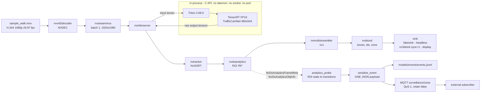

# Final report — person detection in a restricted zone on a Jetson Orin Nano

**Capstone deliverable.** A synthesis of the finished system — an index with
numbers, not a replacement for the engineering record. Every significant claim
links to the milestone document that established it, and those documents hold the
evidence, the alternatives considered and the limitations in full.

All ten milestones are complete. The demo capture is `demo/demo.mp4`, produced
on 2026-08-15 and delivered alongside the repository rather than committed to it
— see [`../demo/README.md`](../demo/README.md). Roadmap, open questions and
technical debt: [`../PLAN.md`](../PLAN.md).

---

## 1. Objective and use case

The system answers one operational question, on the device: **is a person inside
the restricted zone right now?**

That question fixes the design. It is *spatial*, so the AI task is **object
detection** ([M1](milestone-01-use-case.md)). "Entered", "stayed 2.5 seconds" and
"left" are statements about a subject persisting across frames, which a per-frame
detection cannot make, so **tracking** is required
([M5.2](milestone-05-tracking.md)). And the zone belongs to the installation, not
to the images, so occupancy is decided by **ROI analytics configured against the
scene**, not learned by the model ([M5.3](milestone-05-restricted-zone.md)).

The target is an **NVIDIA Jetson Orin Nano Super** (JetPack 7.2, L4T R39.2,
Ubuntu 24.04, 7.3 GiB unified memory, no swap). Everything runs on the device —
no cloud, no training, nothing downloaded at run time. The camera is simulated
from a recorded clip, paced by the pipeline clock so it behaves like a live
29.97 fps source ([M2](milestone-02-video-input.md)).

---

## 2. System architecture



Three properties of the drawing are load-bearing.

**The main video path stays in NVMM** — NVIDIA hardware memory — from decode to
sink. `nvstreammux` batches by reference, and no element forces a copy into
system memory ([M5.1](milestone-05-inference-pipeline.md)).

**The monitoring branch is a metadata tap, not a pipeline stage.** The dashed
edge carries `nvdsanalytics` *metadata* to a pad probe; no video buffer and no
broker sits in the path that carries frames, so an unreachable broker cannot
stall or alter inference ([M9.3](milestone-09-mqtt.md)).

**Triton returns raw tensors** and knows nothing about detections. Clustering and
box decoding happen in DeepStream, after the return edge
([M7](milestone-07-triton.md)).

---

## 3. Implementation and configuration

**Model and precision.** TrafficCamNet — DetectNet_v2 on a pruned ResNet18
backbone, fully convolutional, no anchors and no in-graph NMS — chosen on
engineering suitability rather than leaderboard accuracy: already installed, no
download, no NGC credentials, no custom parser, no `sudo`, and `person` is a
native class ([M3](milestone-03-model-selection.md)). FP32, FP16 and INT8 engines
were built from that one ONNX model with an identical optimisation profile. All
three are real-time for one 29.97 fps camera, so precision was a **headroom
decision, not a feasibility one**; FP16 is deployed and INT8 held in reserve
because its accuracy cost is unquantified
([M4](milestone-04-tensorrt-optimization.md)).

**Pipeline.** Stock `deepstream-app` driven by the `.txt` files in `configs/` —
no custom application binary. NvSORT uses NVIDIA's shipped configuration
unmodified, preferred over IOU (no motion model) and NvDCF (most expensive, and
its distinguishing benefit is untestable on a clip with one never-occluded
person). `nvinferserver` replaces `nvinfer`, backed by an in-process Triton
executing the same FP16 engine byte for byte; the `nvinfer` path stays runnable
from the same scripts ([M7](milestone-07-triton.md)). The 1×1 tiler looks like
dead configuration and is not: without a fresh buffer upstream, `nvdsosd` draws
in place and previous frames' boxes persist as a visible trail
([M5 OSD ghosting](milestone-05-osd-ghosting.md)).

| Setting | Value |
|---|---|
| Model | TrafficCamNet (DetectNet_v2, pruned ResNet18) |
| Precision / input | FP16, `1x3x544x960` (960×544) |
| Batch size | 1 — `min = opt = max`, engine and Triton alike |
| Inference | `nvinferserver` → Triton 2.68.0 (C API) → TensorRT |
| Clustering | NMS, confidence 0.2, IoU 0.5, top-k 20 (class 0 at 0.4) |
| Tracker | NvSORT, 960×544, vendor YAML referenced in place |
| Restricted zone | ROI `RF`, `650;640;1260;640;1260;820;650;820`, `class-id=2` |
| Display sink | `type=2` (nv3dsink), `sync=1` — paced |
| Headless sink | `type=1` (fakesink), `sync=0` |
| MQTT | topic `surveillance/zone`, QoS 1, retain false |

The zone geometry was **derived from the measured track**, not chosen, and placed
so the foot-point rule DeepStream actually uses gives 75 frames while a centroid
rule gives 0 — turning "which point does it test?" into an experiment
([M5.3](milestone-05-restricted-zone.md)).

---

## 4. Deployment

One image, `video-surveillance-deepstream:m7-triton`, driven by one script,
`scripts/run_container.sh`. Configuration and tooling are baked in; the
machine-specific parts — the FP16 engine and the Triton model repository — are
**bind-mounted read-only**, so the container physically cannot write an engine
([M6](milestone-06-containerization.md), [M7](milestone-07-triton.md)). Every
invocation uses `docker run --rm`, with no `--name`, no `-d`, no restart policy
and no volumes, so **no persistent container state exists between runs**. GPU,
NVDEC, VIC and display come from the NVIDIA runtime's CSV injection, with no
`--privileged`, `--device` or `--gpus` ([M8.3](milestone-08-redeployment.md)).

| Mode | Network | Why |
|---|---|---|
| `--headless`, `--zone`, `--events`, `--shell` | explicit `--network none` | Nothing needs a network; the isolation is also evidence that Triton runs in-process |
| `--display` | Docker's **default bridge** | Needs no network, but is not explicitly isolated — no `--network` flag is passed |
| `--events-mqtt` | `--network host` | Required: the broker listens on `127.0.0.1:1883` only |

```bash
./scripts/run_container.sh --display     --triton  # paced visible playback on the monitor
./scripts/run_container.sh --headless    --triton  # deepstream-app to fakesink, writes metadata dumps
./scripts/run_container.sh --events      --triton  # + zone transitions as JSON Lines
./scripts/run_container.sh --events-mqtt --triton  # + the same bytes published over MQTT
```

---

## 5. Performance and verification

**Inference cost, engine only** — batch 1, 960×544, interleaved, three
repetitions per precision ([M4](milestone-04-tensorrt-optimization.md)):

| Engine | GPU compute | Throughput | Frame budget |
|---|---|---|---|
| FP32 (`--noTF32` baseline) | 12.70 ms | 78.7 qps | 38.8% |
| **FP16 (deployed)** | **3.22 ms** | **310.1 qps** | **10.6%** |

A **3.95×** speedup — but it measures the network alone. `trtexec` never saw a
video frame, so this is not the cost of the application.

**Full pipeline** — a 604 s unpaced `file-loop` soak, ~109,000 frames
([M8.2](milestone-08-edge-deployment.md)): **178.14 fps** steady-window mean
(n = 540, sd 1.36), corroborated to **0.06%** by an independent frame count;
against the **29.97 fps** source rate that is **~5.94× processing headroom**,
with no degradation over ten minutes (fitted trend +0.010 fps/min).

> **178 fps is unpaced processing *capacity*, not 178 fps of real-time
> playback.** The soak runs `sync=0` deliberately, to reach the ceiling and the
> harshest thermal condition in one run. The real-time display path uses `sync=1`
> and runs at the source's 29.97 fps.

**Thermal:** junction temperature peaked at **64.97 °C** and all three CPU/GPU
frequency-capping cooling devices stayed at **state 0**. The Jetson heated under
sustained load, but the kernel never applied thermal frequency capping —
*measured* from cooling-device state, not inferred from clock traces.

**Tracking and analytics**, reproduced identically host-native, containerised,
through Triton, after the soak and in the event path
([M5.3](milestone-05-restricted-zone.md),
[M8.3](milestone-08-redeployment.md)): **0 mid-track ID switches** over a
**224-frame** dominant track; zone **entry 109**, **75 frames inside (~2.50 s)**,
**exit 183**, one unbroken interval, **100.00% agreement** with an independent
recomputation.

**Monitoring** ([M9.3](milestone-09-mqtt.md)): **2** transition events for 288
frames; a subscriber started before the pipeline received **2** messages, **2 of
2** acknowledged by the broker, payloads **byte-identical** to the JSON Lines
from the same run.

**Verification model.** Eight headless suites in `scripts/`, none needing a
display, all self-terminating and exiting non-zero on failure. Every assertion
reads per-frame metadata, so a passing run is a statement about data rather than
appearance — and, conversely, the OSD ghosting defect passed every metadata check
while the output was visibly wrong.

---

## 6. Monitoring and logging

DeepStream ships `nvmsgconv` and `nvmsgbroker`, and `[sink] type=6` builds the
pair from configuration alone. That route was tested first and **cannot carry
this use case**: `nvmsgconv` serialises `NvDsEventMsgMeta`, which
`deepstream-app` never attaches, and it never reads the `nvdsanalytics` user
metadata at all. A configuration-only monitoring layer could publish detections
and track IDs but **not whether the person is inside the zone** — everything
except the thing the system exists to detect
([M9.1](milestone-09-inspection.md) §2).

So `tools/analytics_probe.cpp`, the project's only reader of that metadata since
Milestone 5, was extended rather than duplicated. It converts per-frame ROI state
into semantic **transitions** — `zone_enter` at frame **109**, `zone_exit` at
frame **183** on the sample clip — instead of restating on every frame a fact the
consumer already knows. The saving is three orders of magnitude, measured: one
"inside" line per frame is ~353 MB/day at 30 fps, against **2 events totalling
409 bytes** here ([M9.2](milestone-09-events.md)).

Each event is serialised **exactly once** and the same string goes to both sinks,
which is what makes the byte comparison meaningful: MQTT is a *transport of the
verified event*, not a second interpretation of the metadata. Delivery is
**QoS 1 — at-least-once** with broker acknowledgement, not exactly-once.
Retain is off, because a retained intrusion alert would be redelivered to every
future subscriber as though it had just happened. Pointed at a closed port the
run fails loudly and non-zero in 8 s and **still writes the local record**
([M9.3](milestone-09-mqtt.md)).

---

## 7. Results and limitations

The system works end to end: it detects people, holds their identity across
frames, decides restricted-zone occupancy from DeepStream's own analytics
metadata, runs containerised and served through in-process Triton, sustains far
more than real-time throughput without thermal frequency capping, and delivers
the resulting events to a consumer outside the container.

What it does **not** claim:

- **The throughput figure is unpaced** — capacity, not real-time playback.
- **Memory behaviour is unresolved.** RSS grew +84.91 MB over the soak's steady
  window, decelerating and stepwise. No leak is claimed and none is ruled out;
  ten bounded minutes cannot settle it
  ([M8.2](milestone-08-edge-deployment.md) §13).
- **`track_ended` and `stream_ended` are implemented but NOT EXERCISED.** They
  close an interval when a track or the stream ends while an object is still
  inside; this clip's walker leaves cleanly, so neither fired.
- **No detection-accuracy claim.** No labelled ground truth exists for any sample
  clip, so FP16 and INT8 were compared on performance only.
- **Tracker robustness is untested here.** The clip has no interior detector gaps
  and no occlusion, so gap bridging, shadow tracking and occlusion recovery are
  NOT EXERCISED rather than passing.
- **The MQTT result used one local, anonymous broker** on loopback, with **no TLS
  and no authentication**, at QoS 1.
- **The nvinfer/nvinferserver numerical divergence is unexplained** — measured,
  bounded and deterministic, with detection structure, tracking and zone
  behaviour unaffected, but not isolated ([M7](milestone-07-triton.md) §7).
- **Verification is not fully reproducible from a clean clone.**
  `verify_triton.sh` needs a frozen baseline held outside the repository, and the
  Milestone 6 image no longer exists, so `verify_container.sh` is a frozen result
  rather than a runnable one.
- **The demo video is a demonstration, not a measurement.** `demo/demo.mp4` is a
  1280×720 / 15 fps screen capture encoded on the CPU, on the same six cores as
  the pipeline. The figures in §5 are the performance evidence; nothing in the
  video is.

Full open questions and technical debt: [`../PLAN.md`](../PLAN.md) §10 and §11.
